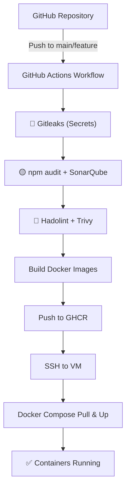

# Conduit Docker Project

This repository contains a Docker Compose setup for running the Conduit application, including a Node.js/Express backend and an Angular frontend.  
The project is designed to be easy to deploy, with persistent data storage, configurable environment variables, and **enterprise-grade security scanning**.

## Table of Contents
- [Quickstart](#quickstart)
- [Usage](#usage)
    - [Environment Variables](#environment-variables)
    - [Volumes](#volumes)
    - [Restarting and Stopping Containers](#restarting-and-stopping-containers)
- [Security](#security)
- [GitHub Actions Deployment](#github-actions-deployment)
- [Extras](#extras)

## Quickstart

### Prerequisites
- Docker
- Docker Compose
- GitHub Actions enabled (for automated build & deployment)

### Steps
1. Clone this repository:
```bash
git clone git@github.com:A-Marbach/conduit-container.git
cd conduit-container
```

2. Initialize submodules (backend and frontend):
```bash
git submodule update --init --recursive
```

3. Copy the example environment file:
```bash
cp backend/.env.example backend/.env
```

4. Build the containers:
```bash
docker-compose build --no-cache
docker-compose up -d
```

5. Open the application in your browser:
* Frontend: `http://<your_vm_ip>:8282`
* Backend API: `http://<your_vm_ip>:5000/api/`

## Usage

Navigate to the frontend URL to use the Conduit application.

The backend API is available at `/api/`.

Make sure all environment variables are correctly set before starting.

## Environment Variables

You can modify `.env` files or the `environment:` section in `docker-compose.yaml` for a secure deployment:

| Variable           | Description                       | Default                     |
|--------------------|-----------------------------------|-----------------------------|
| DJANGO_SECRET_KEY  | Django secret key                 | changeme                    |
| DATABASE_NAME      | Name of the PostgreSQL/SQLite DB  | conduit                     |
| DATABASE_USER      | Database username                 | user                        |
| DATABASE_PASSWORD  | Database password                 | password                    |
| DATABASE_HOST      | Database host                     | db                          |
| DATABASE_PORT      | Database port                     | 5432                        |

## Volumes

* `backend_data`: Stores backend data (persistent storage)
* `frontend_data`: Stores frontend build files

Volumes ensure data persists even after container restarts or recreation.

### Restarting and Stopping Containers

```bash
# Restart containers
docker-compose restart

# Stop and remove containers
docker-compose down
```

## Security

### Best Practices
* ❌ Do not commit `.env` files, SSH keys, passwords, or any sensitive information to the repository.
* ❌ Do not include IP addresses or credentials in the frontend code.
* ✅ Use GitHub Secrets for all sensitive environment variables (API keys, database credentials, etc.).
* ✅ Use `.gitleaks.toml` to define secret scanning rules.

### Automated Security Scanning (CI/CD Pipeline)

Every push triggers a **multi-stage security pipeline** before any image is built or deployed. The pipeline implements **DevSecOps best practices** with security gates at each stage.

#### Security Pipeline Flow

```
Push to GitHub
       ↓
Stage 1: Secret Detection (Gitleaks) 🔴 CRITICAL
       ↓
Stage 2: Code Quality & Dependencies (npm audit + SonarQube) 🟡 INFO
       ↓
Stage 3: Infrastructure & Containers (Hadolint + Trivy) 🔴 + 🟡
       ↓
Build & Push Docker Images (GHCR)
       ↓
Deploy to VM
```

#### Stage 1: Secret Detection
**Tool:** [Gitleaks](https://github.com/gitleaks/gitleaks)
- Scans entire Git history for hardcoded secrets (API keys, database URLs, tokens, passwords).
- Detects patterns for: AWS Keys, GitHub Personal Access Tokens, Firebase API Keys, MongoDB connection strings, Slack/Discord tokens, Private Keys (RSA, EC, DSA), OpenAI API Keys, and more.
- **Blocks the pipeline** if secrets are found to prevent accidental exposure.
- Configuration: `.gitleaks.toml`
- **Status:** 🔴 **CRITICAL** – Pipeline fails if secrets detected

#### Stage 2: Code Quality & Dependencies
**Tools:** npm audit, [SonarQube Cloud](https://sonarcloud.io/projects/conduit)

**npm audit:**
- Audits `package.json` for known vulnerabilities (CVEs) in backend and frontend dependencies.
- Checks at `--audit-level=moderate` (detects HIGH and CRITICAL issues).
- Provides detailed vulnerability reports with fix recommendations.
- **Status:** 🟡 **INFO** – Reported but doesn't block build

**SonarQube (SAST - Static Application Security Testing):**
- Performs deep code analysis on backend (`backend/src`) and frontend (`frontend/src`).
- Detects security hotspots: SQL Injection, Cross-Site Scripting (XSS), Broken Authentication, Insecure Deserialization, Hard-coded credentials, Missing input validation.
- Analyzes code quality: Code smells, duplications, tech debt, test coverage gaps, maintainability ratings.
- Results available at: [SonarCloud Dashboard](https://sonarcloud.io/projects/conduit)
- Exclusions: `node_modules/`, `dist/`, `coverage/`
- **Status:** 🟡 **INFO** – Reported but doesn't block build

#### Stage 3: Infrastructure & Container Scanning
**Tools:** [Hadolint](https://github.com/hadolint/hadolint), [Trivy](https://github.com/aquasecurity/trivy)

**Dockerfile Linting (Hadolint):**
- Lints both `backend/Dockerfile` and `frontend/Dockerfile`.
- Checks for best practices: Non-root USER, pinned image versions, HEALTHCHECK directives, minimal layers.
- **Fails on any `error`-level finding.**
- **Status:** 🔴 **CRITICAL** – Pipeline fails on errors

**Container Image Scanning (Trivy):**
- Scans built Docker images for known vulnerabilities in OS packages and application dependencies.
- Detects OS-level and application-level vulnerabilities at severity `HIGH` and `CRITICAL`.
- Runs after local image build, before push to GHCR.
- **Status:** 🟡 **INFO** – Reported but doesn't block build

**Result:** Build and deployment only proceed if **all CRITICAL gates pass**. ✅

---

## GitHub Actions Deployment

The deployment workflow uses GitHub Actions to automate the entire build, test, security scan, and deployment process.

### Workflow Overview

```
1. Code Push to GitHub
   ↓
2. Run Security Scans (Gitleaks, npm audit, SonarQube, Hadolint, Trivy)
   ↓
3. Build Docker Images (backend & frontend)
   ↓
4. Push to GitHub Container Registry (GHCR)
   ↓
5. Deploy to VM (pull images, restart containers)
```

### Workflow File
- Location: `.github/workflows/main.yaml`

### Required Secrets
Store these in GitHub repository settings under **Settings → Secrets and variables → Actions**:

| Secret | Description | Example |
|--------|-------------|---------|
| `GHCR_PAT` | GitHub Personal Access Token for container registry | `ghp_1234567890...` |
| `SSH_HOST` | Target VM hostname or IP | `192.168.1.100` |
| `SSH_USER` | SSH username for VM deployment | `deploy` |
| `SSH_KEY` | SSH private key for authentication | (Multi-line private key) |
| `SSH_PORT` | SSH port | `22` |
| `SONAR_TOKEN` | SonarQube Cloud authentication token | `squ_1234567890...` |
| `SONAR_HOST_URL` | SonarQube Cloud URL | `https://sonarcloud.io` |

### Notes
- The VM **no longer builds images itself** – it only pulls pre-built images from GHCR.
- All security checks run **before** any image is built or pushed.
- Deployment is fully automated after successful security gates.

### Deployment Flow Diagram



---

## Extras

* You can add additional frontend features or backend services as needed.
* Extend the security pipeline by adding more scanning tools (e.g., OWASP Dependency-Check, etc.).
* Monitor the SonarQube dashboard regularly to track code quality trends.

---

## Troubleshooting

### Workflow Failed: "Gitleaks found leaks"
1. Check the GitHub Actions logs to see which file has the secret.
2. Remove or move the secret to `.env` (which is in `.gitignore`).
3. Commit the fix and push again.

### Workflow Failed: "Hadolint error in Dockerfile"
1. Check the error message in GitHub Actions logs.
2. Fix the Dockerfile issue.
3. Commit and push.

### SonarQube Scan Not Running
1. Verify `SONAR_TOKEN` and `SONAR_HOST_URL` are set in GitHub Secrets.
2. Check that the organization exists on SonarCloud.
3. Ensure the project key is correct.

---

> **Note:**  
> Edit the `.env` files if you want custom credentials.  
> Do **not** commit `.env` files to the repository, as they contain sensitive information.  
> Use GitHub Secrets and environment variables instead.

---

**DevSecOps Status:** ✅ Full security pipeline implemented (Gitleaks, npm audit, SonarQube, Hadolint, Trivy)
